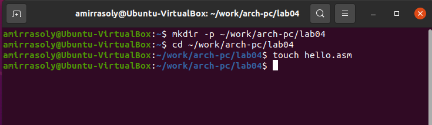
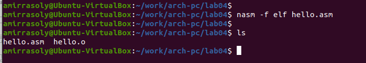
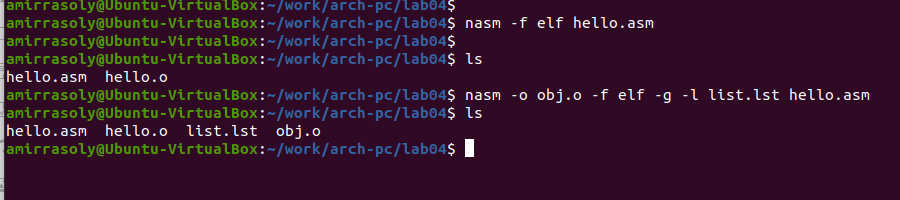
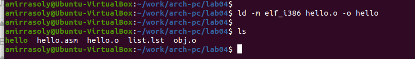
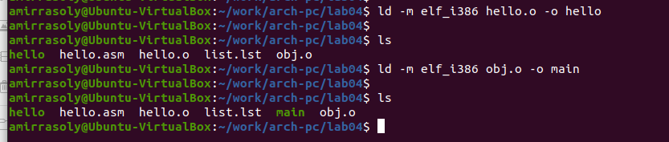
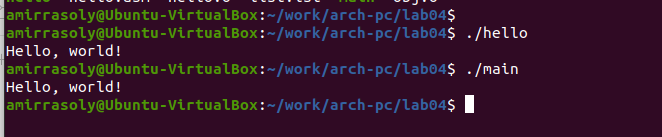
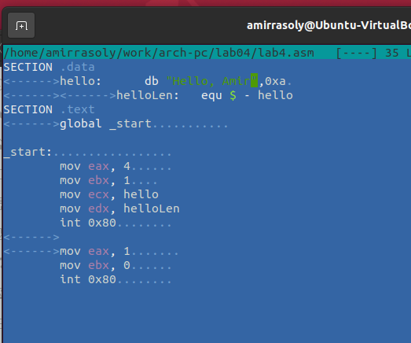
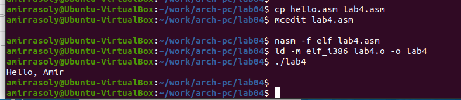

---
## Front matter
title: "Отчёт по лабораторной работе 4"
subtitle: "Архитектура компьютеров"
author: "Амир Расули"

## Generic otions
lang: ru-RU
toc-title: "Содержание"

## Bibliography
bibliography: bib/cite.bib
csl: pandoc/csl/gost-r-7-0-5-2008-numeric.csl

## Pdf output format
toc: true # Table of contents
toc-depth: 2
lof: true # List of figures
lot: true # List of tables
fontsize: 12pt
linestretch: 1.5
papersize: a4
documentclass: scrreprt
## I18n polyglossia
polyglossia-lang:
  name: russian
  options:
	- spelling=modern
	- babelshorthands=true
polyglossia-otherlangs:
  name: english
## I18n babel
babel-lang: russian
babel-otherlangs: english
## Fonts
mainfont: PT Serif
romanfont: PT Serif
sansfont: PT Sans
monofont: PT Mono
mainfontoptions: Ligatures=TeX
romanfontoptions: Ligatures=TeX
sansfontoptions: Ligatures=TeX,Scale=MatchLowercase
monofontoptions: Scale=MatchLowercase,Scale=0.9
## Biblatex
biblatex: true
biblio-style: "gost-numeric"
biblatexoptions:
  - parentracker=true
  - backend=biber
  - hyperref=auto
  - language=auto
  - autolang=other*
  - citestyle=gost-numeric
## Pandoc-crossref LaTeX customization
figureTitle: "Рис."
tableTitle: "Таблица"
listingTitle: "Листинг"
lofTitle: "Список иллюстраций"
lotTitle: "Список таблиц"
lolTitle: "Листинги"
## Misc options
indent: true
header-includes:
  - \usepackage{indentfirst}
  - \usepackage{float} # keep figures where there are in the text
  - \floatplacement{figure}{H} # keep figures where there are in the text
---

# Цель работы

Целью работы является освоение процедуры компиляции и сборки программ, написанных на ассемблере NASM.

# Теоретическое введение

NASM (англ. Netwide Assembler) – это 80x86 ассемблер, который был разработан с упором на переносимость и модульность. Он поддерживает множество форматов объектных файлов, таких как форматы `Linux a.out` и `ELF`, `NetBSD/FreeBSD`, `COFF`, Microsoft 16-bit OBJ и Win32. Помимо этого, NASM также может генерировать простые бинарные файлы. Синтаксис NASM схож с Intel-синтаксисом, хотя немного сложнее. Он поддерживает инструкции для процессоров Pentium, P6 и MMX, а также включает макро-расширения.

NASM был создан Саймоном Тэтхемом совместно с Юлианом Холлом и в настоящее время развивается командой разработчиков на SourceForge.net. Изначально он был выпущен под собственной лицензией, но после множества проблем с выбором лицензии она была заменена на GNU LGPL. Начиная с версии 2.07, лицензия заменена на "упрощённую BSD" (BSD из 2 пунктов).

NASM может работать на различных платформах, таких как SPARC и PowerPC, однако код генерируется исключительно для x86 и x86-64 архитектур.

NASM является конкурентом стандартному для Linux и многих UNIX-систем ассемблеру `gas`. Примечательно, что документация NASM считается более качественной, чем у `gas`. Кроме того, `gas` использует синтаксис AT&T, предназначенный для процессоров не от Intel, в то время как NASM придерживается Intel-синтаксиса, который традиционно используется в x86-ассемблерах, таких как MASM, TASM и fasm.

NASM использует Intel-синтаксис записи инструкций. Строка программы NASM может включать следующие элементы: метку, инструкцию, операнды и комментарий.

Операнды отделяются запятыми. Пробелы допустимы перед строкой и после инструкции. Комментарий начинается с точки с запятой, и его конец совпадает с концом строки. Если строка программы слишком длинная, её можно перенести на следующую с помощью обратного слэша ( \ ), аналогично языку C.

# Выполнение лабораторной работы

## Программа Hello world!

Создаю каталог `lab04` с помощью команды `mkdir`, перехожу в него с помощью `cd`, и создаю файл `hello.asm`. (рис. [-@fig:001])

{ #fig:001 width=70%, height=70% }

Открываю файл и пишу код программы по заданию. (рис. [-@fig:002])

{ #fig:002 width=70%, height=70% }

## Транслятор NASM 

Транслирую файл командой `nasm`, что позволяет получить объектный файл `hello.o`. (рис. [-@fig:003])

{ #fig:003 width=70%, height=70% }

Использую команду `nasm` с дополнительными опциями для создания файла листинга `list.lst`, объектного файла `obj.o`, и добавляю отладочную информацию в программу. (рис. [-@fig:004])

{ #fig:004 width=70%, height=70% }

## Компоновщик LD

Выполняю линковку с помощью команды `ld` и получаю исполняемый файл. (рис. [-@fig:005])

{ #fig:005 width=70%, height=70% }

Повторяю линковку для объектного файла `obj.o` и получаю исполняемый файл `main`. (рис. [-@fig:006])

{ #fig:006 width=70%, height=70% }

Запускаю полученные исполняемые файлы. (рис. [-@fig:007])

{ #fig:007 width=70%, height=70% }

## Выполнение заданий для самостоятельной работы.

Копирую программу в новый файл.

Изменяю сообщение "Hello world" на своё имя (рис. [-@fig:008]) и запускаю новую программу. (рис. [-@fig:009])

{ #fig:008 width=70%, height=70% }

{ #fig:009 width=70%, height=70% }

# Выводы

В ходе выполнения лабораторной работы я освоил процесс компиляции и сборки программ на ассемблере NASM. Полученные навыки включают создание объектных файлов, использование транслятора и компоновщика, а также работу с отладочной информацией и выполнение программ.

# Список литературы{.unnumbered}

1. Архитектура ЭВМ - Материалы курса

2. NASM Документация